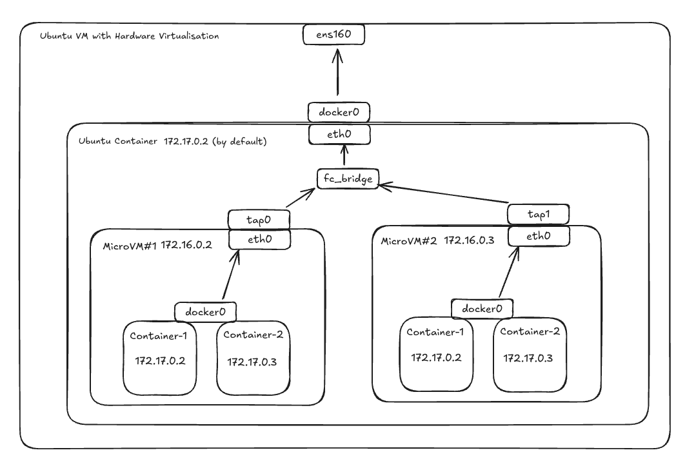

# firecracker-dind

**IMPORTANT NOTE:** This repo structure is currently in the process of discovering microVM's and their networking. That's why probably README and other files will change over time for better adaptability. Try to understand before using it.

## Why?

I was working on creating an isolated network lab environment where laborants can use real world VMs to create network labs and topologies in an isolated environments than other labs. Using microVMs provides both increased security and mimics real production machine.

## Why firecracker inside a container

Putting microVMs inside a container makes managing networks way easier and also takes care of cleaning things up. Normally, setting up networking for a microVM means creating a tun/tap device on the host, connecting it to the microVM, and adding a bunch of iptables rules to handle the traffic. It’s not too bad with just a few microVMs, but doing this for dozens on one host can get pretty annoying. The good news is, most of the networking stuff, like setting up tun/tap devices, can be handled inside a separate network space in a Docker container. Plus, when you shut down a VM, the container stops too, so Docker automatically cleans everything up for you.

## Prerequisites
- VM with hardware virtualisation enabled
    - The host VM needs to support hardware virtualisation. If the VM is created in vCenter, you need to enable hardware virtualization checkbox which you can see in `Customise Hardware` step when you expand the `CPU` line.
    - As far as I can tell, Heitzner VMs **doesn't** support this, **Digital Ocean** and **GCP** supports and only `metal` type EC2 instances are supporting this in AWS.
    - You can run `egrep -c '(vmx|svm)' /proc/cpuinfo` command to verify if it's enabled after running the VM. If this command gives output bigger than 0, then it's enabled for that number of CPU.

Create ssh key pair with `ssh-keygen -f id_rsa -N "" -f ./id_rsa`

## Compile Kernel

Kernel version used here is v5.10. You can of course compile different kernel versions. There are different ways of compiling kernel. You may do this with firing up an Ubuntu VM.

### Option 1:

To be able to do this, you need to install docker first because it's compiling the kernel inside a container. It'll take a while...

```sh
$ git clone git@github.com:firecracker-microvm/firecracker.git firecracker
$ cd firecracker
$ cp kernel-config ./resources/guest_configs/microvm-kernel-ci-x86_64-5.10.config
$ ./tools/devtool build_ci_artifacts kernels 5.10
$ cp ./resources/$(uname -m)/vmlinux-5.10.225 ../firecracker/vmlinux-5.10.225
```

### Option 2:

This option compiles kernel v6.1 and it's tested in Ubuntu 24.04 VM.
```sh
$ KERNEL_VERSION=6.1
$ curl -L https://cdn.kernel.org/pub/linux/kernel/v6.x/linux-${KERNEL_VERSION}.tar.xz > linux-${KERNEL_VERSION}.tar.xz
$ mkdir -p linux-${KERNEL_VERSION}
$ tar --skip-old-files --strip-components=1 -Jxf linux-${KERNEL_VERSION}.tar.xz -C linux-${KERNEL_VERSION}
$ cd linux-${KERNEL_VERSION}
# Copy firecracker kernel v6.1 config file into .config file under our kernel folder
# If you want to use custom kernel config, you can create one and put it `.config` file under kernel folder as above wget command or you can get the example one from firecracker and edit it
$ wget -O .config https://raw.githubusercontent.com/firecracker-microvm/firecracker/main/resources/guest_configs/microvm-kernel-ci-x86_64-6.1.config
# install make if needed with below:
$ sudo apt install build-essential -y
# Also install below packages to compile kernel
$ sudo apt install -y libncurses-dev pkg-config flex bison bc libelf-dev libssl-dev
# You can make interactive config adjustments using below. If you are fine with your config, you can skip this step
$ make menuconfig # This will open a TUI where you can customise the options.
$ make vmlinux # for x86_64 architecture and "make Image" for aarch64
```

### Option 3

Or you can clone the linux kernel repo and build the kernel version you want with your own config.

```sh
$ git clone https://github.com/torvalds/linux.git linux.git
$ cd linux.git
# Check out the Linux version you want to build (e.g. we'll be using v4.20 here):
$ git checkout v4.20
# You can make interactive config adjustments using below. If you are fine with your config, you can skip this step
$ make menuconfig # This will open a TUI where you can customise the options.
$ make vmlinux # for x86_64 architecture and "make Image" for aarch64
```

**NOTE:** Below is a comprehensive (though not necessarily minimal) list of kernel configuration options that should be enabled (compiled as either built-in =y or loadable modules =m) to run Docker successfully on a Linux host:

```sh
# Namespaces
CONFIG_NAMESPACES=y
CONFIG_UTS_NS=y
CONFIG_IPC_NS=y
CONFIG_USER_NS=y
CONFIG_PID_NS=y
CONFIG_NET_NS=y

# cgroups
CONFIG_CGROUPS=y
CONFIG_CGROUP_SCHED=y
CONFIG_CGROUP_DEVICE=y
CONFIG_CGROUP_FREEZER=y
CONFIG_CGROUP_CPUACCT=y
CONFIG_CGROUP_PIDS=y
CONFIG_MEMCG=y
CONFIG_BLK_CGROUP=y
CONFIG_CGROUP_HUGETLB=y

# OverlayFS
CONFIG_OVERLAY_FS=y

# Netfilter + iptables
CONFIG_NETFILTER=y
CONFIG_NF_TABLES=y
CONFIG_NF_CONNTRACK=y
CONFIG_NF_NAT=y
CONFIG_NF_NAT_IPV4=y
CONFIG_NF_NAT_MASQUERADE_IPV4=y
CONFIG_NFT_MASQ=y
CONFIG_NFT_REDIR=y
CONFIG_NETFILTER_XTABLES=y
CONFIG_IP_NF_IPTABLES=y
CONFIG_IP_NF_FILTER=y
CONFIG_IP_NF_NAT=y
CONFIG_IP_NF_MANGLE=y
CONFIG_NETFILTER_XT_TARGET_MASQUERADE=y
CONFIG_NETFILTER_XT_MATCH_ADDRTYPE=y
CONFIG_NETFILTER_XT_MATCH_CONNTRACK=y

# Virtual Network Interfaces
CONFIG_VETH=y
CONFIG_BRIDGE=y
CONFIG_BRIDGE_NETFILTER=y

# Security (Recommended)
CONFIG_SECCOMP=y
CONFIG_SECCOMP_FILTER=y
CONFIG_KEYS=y
CONFIG_CRYPTO_USER_API_HASH=y
CONFIG_CRYPTO_USER_API_SKCIPHER=y
CONFIG_DEVPTS_MULTIPLE_INSTANCES=y

# cgroups v2 (Optional)
CONFIG_CGROUP_V2=y
CONFIG_CGROUP_BPF=y
```

## Creating a rootfs Image

A rootfs image is just a file system image, that hosts at least an init system. We'll use a docker container to create ubuntu ext4 type rootfs. This container is using `debootstrap` command to create it with my needs. Feel free to try different ways to create rootfs. You can check [firecracker docs](https://github.com/firecracker-microvm/firecracker/blob/main/docs/rootfs-and-kernel-setup.md#creating-a-rootfs-image) to see another way of creating a rootfs image.

1. Build rootfs image with:
```sh
docker build -f Dockerfile.rootfs -t ubuntu-rootfs .
```
2. Run the image with:
```sh
docker run --privileged -it --rm -v $(pwd)/output:/output ubuntu-rootfs
```

This will create output folder and put the image rootfs file named `image.ext4` under it. This will be our microVM's rootfs image.

## Running Firecracker Container

You can run the ubuntu container with firecracker binary installed with below commands:

1. Build the image with:
```sh
docker build -f Dockerfile.firecracker -t ubuntu-systemd .
```

2. If you want to use different network than the default docker bridge, create the new bridge with:
```sh
# You may want to use different subnet, gateway and name, this is just an example
docker network create --driver=bridge --subnet=172.31.0.0/30 --gateway=172.31.0.1 br-test
```

3. Run the image with:
```sh
docker run -d --privileged --name ubuntu-firecracker ubuntu-systemd

# If you don't want to run the container with full priviliges, you can run it with below restrictions:
docker run -d --cap-add=NET_ADMIN --cap-add=SYS_ADMIN --name ubuntu-firecracker ubuntu-systemd
```

4. Run the firecracker MicroVM with(please read `What is this image doing` and `What is docker-entrypoint.sh doing` sections first):
```sh
docker exec -it ubuntu-firecracker firecracker --no-api --config-file /opt/firecracker/firecracker-config.json
```

This will put you directly inside the microVM. It's not ideal because it's a serial console and ssh would be better, but it works for now. You can now run `docker run -d --name test -p 8080:80 httpd` inside the microVM and test it with `curl http://localhost:8080` and see it's working.

**NOTE:** Inside the `Dockerfile.firecracker` dockerfile, there are lines to copy the compiled kernel and bootstrapped rootfs. You may change those lines with your file locations or you can copy them under `firecracker` folder in this repo.

### What is this image doing?

- Uses `Ubuntu 24.04` as base image,
- Installs widely-used packages in ubuntu along with packages to install docker,
- Unminimize the ubuntu base image(you don't have to do this and it might change for me as well),
- Installs `firecracker` binary
- Creates `/opt/firecracker` folder and copies kernel, rootfs and firecracker config inside it,
- Copies `docker-entrypoint.sh`, which is under `scripts` folder, and configure it as `CMD`

### What is `docker-entrypoint.sh` doing?

- Creates a `/30` TAP device named `tap0`,
- Sets the IP address as `172.16.0.1/30`,
- Brings this device up,
- Enables IP Forwarding `sysctl` option,
- Setups `iptables` rules for NAT(necessarry for microVM internet access through container's interface)
- Starts the `systemd`

We now have a running `httpd` container inside an ubuntu 24.04 microVM which runs inside an ubuntu 24.04 container which runs inside a VM with the OS choice of yours(mine was ubuntu 24.04). With this, you have the below setup:



## **IMPORTANT**:

`docker-entrypoint.sh` is creating the TAP device and `iptables` NAT rules but it's useful to check if the rule exists since it's crucial for microVM's internet access.

```sh
# -t nat: Specifies the nat table.
# -A POSTROUTING: Appends the rule to the POSTROUTING chain. This chain is used for altering packets as they leave the network interface.
# -o eth0: Specifies that this rule applies to packets going out through the eth0 interface.
# -j MASQUERADE: Tells iptables to perform source NAT, replacing the source IP address with the IP of the outgoing interface (eth0)

iptables -t nat -A POSTROUTING -o "$HOST_IFACE" -j MASQUERADE

# List existing rules with below:
iptables -t nat -L POSTROUTING -n -v --line-numbers
# Example output, see the second rule:
# Chain POSTROUTING (policy ACCEPT 42 packets, 2712 bytes)
# num   pkts bytes target              prot opt in     out     source               destination
# 1        2   152 DOCKER_POSTROUTING  0    --  *      *       0.0.0.0/0            127.0.0.11
# 2        0     0 MASQUERADE          0    --  *      eth0    0.0.0.0/0            0.0.0.0/0
```
